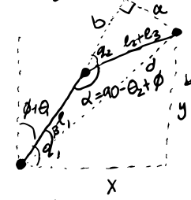
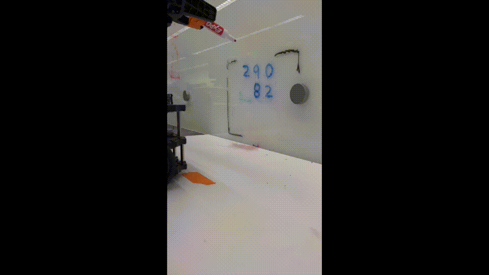
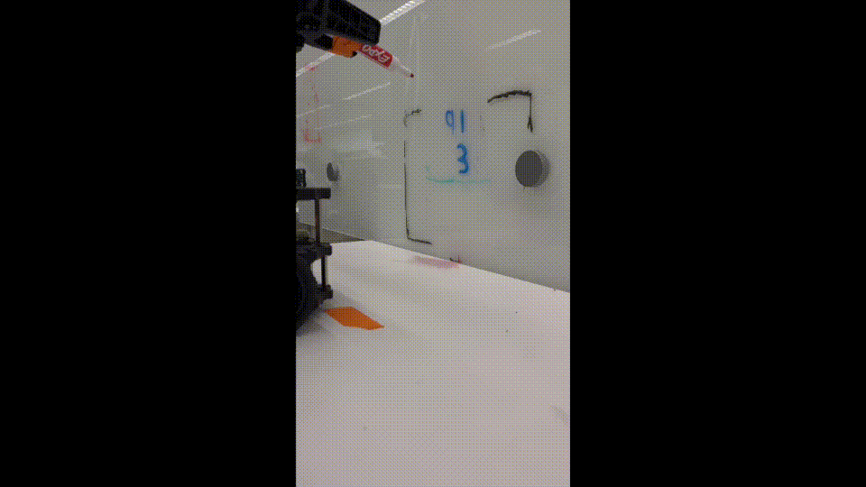
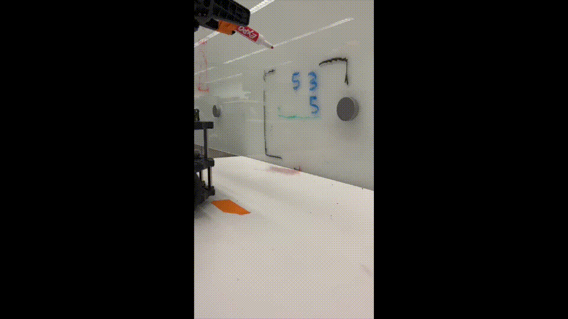
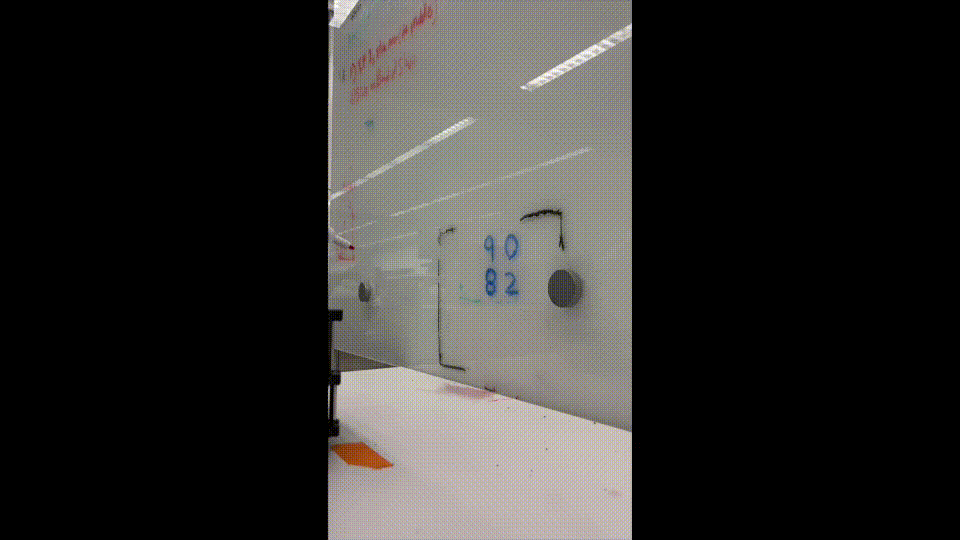

# Autonomous-Robot-Math-Solver
In this project, we program a Turtlebot to autonomously analyze addition problems on a whiteboard and physically write out their answers. The robot uses computer vision to decipher the whiteboard and implements an inverse kinematics algorithm to move the robot arm and draw numbers.

## Team Members
Jay Sivadas, Tejas Kannan, Logan Sherwin, Justin Jones

## Project Description
The goal of this project is to present a Turtlebot with addition problems on a whiteboard with an integer number of digits within the visible frame. The robot then emulates the actions that a human would to solve the problem. This process involves the robot solving single-digit sums from right to left across the problem, including carrying any `1`'s and physically marking the carry when there is overflow in the summation. The robot writes the proper calculation of the math problem below the actual problem on the whiteboard.
This project requires a few main parts: 
1. The robot utilizes its front-facing camera to read an image of the math problem on the whiteboard. This image gets passed through a custom computer vision algorithm that extracts the color of the written digits (blue in our case) and segments the digits. It then uses a convolutional neural network to classify the individual numbers for the calculation. From this image processing, the robot obtains the values and pixel locations of each digit in an ordered list (left to right and top to bottom).


2. The robot performs the addition operation by breaking apart the integers to sum one column at a time. From this step, we obtain the answer digits and any carry values.

3. The Turtlebot then uses the digit pixel locations to determine where to draw the answer digits. We implement this component using an inverse kinematics algorithm which moves the robot's arm to the desired position on the whiteboard.


4. The Turtlebot then uses the digit pixel locations to determine where to draw the answer digits. We implement this component using an inverse kinematics algorithm which moves the robot's arm to the desired position on the whiteboard.

5. The robot then uses another inverse kinematics algorithm to draw each digit. We implement the ability to draw horizontal and vertical straight lines, and we construct each digit using combinations of horizontal and vertical movements.




## System Architecture
We implemented algorithms in two major robotics areas: computer vision and inverse kinematics. The computer vision portion analyzes images of an addition problem. The kinematics component directs the arm to draw the answer digits in their correct locations. We highlight these components below.

### Computer Vision
The computer vision segment uses a custom process to analyze handwritten addition problems observed through the Turtlebot's camera. The function `extract_digits()` in `extract_digits.py` manages the image segmentation and classification. We assume that the problem's digits are written in blue marker; these lines are the only blue colors in the visual frame. We first threshold the image to extract these blue lines and then fit bounding boxes for each digit. Then, we clip the image to each bounding box, convert the clipping to grayscale, and classify the digit as 0-9 using a convolutional neural network trained on MNIST (`DigitClassifier.predict()` in `extract_digits.py`). We trained this neural network ourselves using Tensorflow (Keras) (`train_digit_classifier.py`) and then reimplemented the computational graph using `numpy` and `scipy` to perform inference. This reimplementation allowed us to avoid installing Tensorflow on our virtual machines. Once we have the classified digits, we group them into two horizontal rows. This grouping works by splitting along the largest vertical gap amongst digits (`group_digits()` in `extract_digits.py`). We find that the camera is low resolution and sometimes inconsistent. To mitigate transient issues, we take multiple trials of the image segmentation and use the majority classification results. Once we have the final digit results, we perform the addition (`image_callback()` in `arm.py`) to get the digits to draw.

### Inverse Kinematics
The inverse kinematics component controls the arm's movements when drawing. The first portion of this process is to find *where* to draw the digits. We make this determination using the location of the problem in the image (`get_answer_locations()` in `utils.py`). This process produces the locations to draw in pixels. We convert these pixel locations to distances in meters using hand-calibrated measurements of the visible frame (`image_point_to_draw_digit()` in `utils.py`). We then have the positions in meters of where to draw, and we manually create functions to handle the drawing of each digit (`draw_[digit]` in `arm.py`). We move the arm to these desired locations using inverse kinematics by treating the arm as a 3-joint entity; we always set the arm's joint angle `3` to `0`. Consider moving to a point `(horizontal, vertical)` on the board. Then, `theta0`, the angle for joint `0`, is `theta0 = arctan2(horizontal, length2 + length3 + pen_length)` where `length2` is the length between joints `1` and `2` and `length3` is the length between joints `2`, and `3`. We want to arm to touch the board at the `vertical` position along this `theta0`. Viewed from a horizontal cross-section, this problem is a 2-joint arm where the horizontal distance is `horizontal / sin(theta0)` and the vertical distance is `arm_height + vertical`. We use the law of cosines to solve for `theta1` and `theta2`. [This document](calculations/kinematics.pdf) contains the full inverse kinematics calculations, and the function `set_arm_position_vertical()` in `arm.py` implements this logic. We made small adjustments to correct for imprecision with the physical Turtlebot. The Turtlebot uses these kinematics to draw the answer and carry digits from least to most significant (`draw_answer_digit()` in `arm.py`). Note that we tape the robot's marker directly to the gripper, as the gripper does not close tight enough to hold the whiteboard pen.

## ROS Node Diagram


## Execution
Note: The following is required for the program to run properly:
- All digits should be written in dark blue ink, and other parts of the problem should be in another color. Faint or light lines may be ignored by the computer vision module. The addition sign should be small.
- Digits should be spaced apart for proper segmentation.
- The front of the robot should be facing directly to the board at a distance of 21cm.

### Process
1. Terminal 1: ```roscore```
2. Terminal 2: ```ssh``` into robot and run ```bringup```
3. Terminal 3: ```ssh``` into robot and run ```bringup_cam```
4. Terminal 4: ```rosrun image_transport republish compressed in:=raspicam_node/image raw out:=camera/rgb/image_raw```
5. Terminal 5: ```roslaunch turtlebot3_manipulation_bringup turtlebot3_manipulation_bringup.launch```
6. Terminal 6: ```roslaunch turtlebot3_manipulation_moveit_config move_group.launch```
7. Terminal 7: ```roslaunch math_solver start.launch```

## Challenges
We initially ran into a few challenges in our implementation. For the inverse kinematics algorithms, we learned that precision in measurements is extremely important. We initially hand-measured the robot's arm lengths, but this process led to inaccuracies, causing the robot to not move its arm to the precise desired location. Furthermore, a major issue was that Joint 2 is set slightly ahead of Joint 1; the two joints are not vertically aligned. This property caused issues in the distance and angle calculations of our inverse kinematics, as our settings for joint angles 1 and 2 were off by an additive factor. It was not until we observed the arm's document that we realized this issue. To solve this problem, we instead set the length of joint 1 to the hypotenuse of the triangle created by this offset, and we explicitly accounted for the angle offset in the kinematics calculations. We also initially tried to use grayscale thresholding for digit extraction, but lighting/glare on the whiteboard made this procedure too sensitive. We instead made a simplifying assumption that the digits were written in blue ink and used color-based thresholding to extract the blue lines. Alone, this thresholding led to poor classification due to the camera's low resolution. Instead, we only use color-based thresholding to extract digit bounding boxes. After getting the digit bounding boxes, we use adaptive grayscale thresholding *within* each digit bounding box to get more precise images. This method led to better digit classification.

## Future Work
As the robot currently operates, it can only solve "addition" questions on the whiteboard. In the future, we hope to add functionality for subtraction, multiplication, and long division. Most of the processes would be similar (identifying digits, calculating starting drawing location, and drawing numbers) with slight alterations to the control flow. Long division would be the most difficult, as these problems are written differently than addition, subtraction, and multiplication. We would also have to extend our classifier to identify the operator (addition, subtraction, multiplication, etc...) and not just the individual numbers. Furthermore, implementing additional operators means the Turtlebot must draw digits in multiple horizontal rows on the whiteboard. This behavior requires more whiteboard space, so the original problem must be higher on the board. Thus, to recognize such arithmetic problems, the Turtlebot would need a camera higher up.

We also would extend the current functionality to draw digits with curved lines instead of using only straight components. This behavior would require either a more flexible arm or a decomposition of curve lines into smaller, straight segments. This behavior would make our Turtlebot draw digits that appear more like that of humans when solving arithmetic problems.

## Takeaways
1. The importance of teamwork in developing ideas from the ground up.
- The project we implemented had multiple moving parts ranging from digit recognition to calculations to actual arm programming. Some parts were independent, and some parts directly relied on each other to operate.
- In planning the actual development, our teamwork led to a smooth process for the design and outline of our project. We were able to discuss what part we needed and brainstorm together on how to tackle challenges.
- The final robot result was a product of starting from the beginning with a clear vision of what we wanted to accomplish, and the initial work of our group provided that clarity.
2. The difficulties of inverse kinematics in achieving complex functional movements with pinpoint accuracy.
- Before this project, we did not really understand the difficulty of inverse kinematics calculations. We believed we could change a single angle on the robot to draw horizontally and vertically, but we quickly realized that the marker would come off the board. This experience led to a deeper discussion on the inverse kinematics of our problem.
- Implementing the kinematics algorithms required us to undergo trial and error multiple times to calibrate the robot to the actual real-world environment. At even just three angles, there were many moving parts we had to account for. Furthermore, we found that the robot's arm was not perfectly precise, leading to differences between theory and practice.
- The difficulty it must take to implement inverse kinematics algorithms with even more joints, especially in situations like robot surgery programming that requires millimeters of precision, seems much more daunting after this project.

## Demo
The GIFs below show examples of the Turtlebot solving addition problems on a whiteboard. These same videos are in [this Google Drive folder](https://drive.google.com/drive/folders/1yF00Exp_nhJEt3AJx4cHzMSwA0S5E9J6?usp=share_link). These five examples show how the Turtlebot can recognize and draw all 10 digits (0-9).










